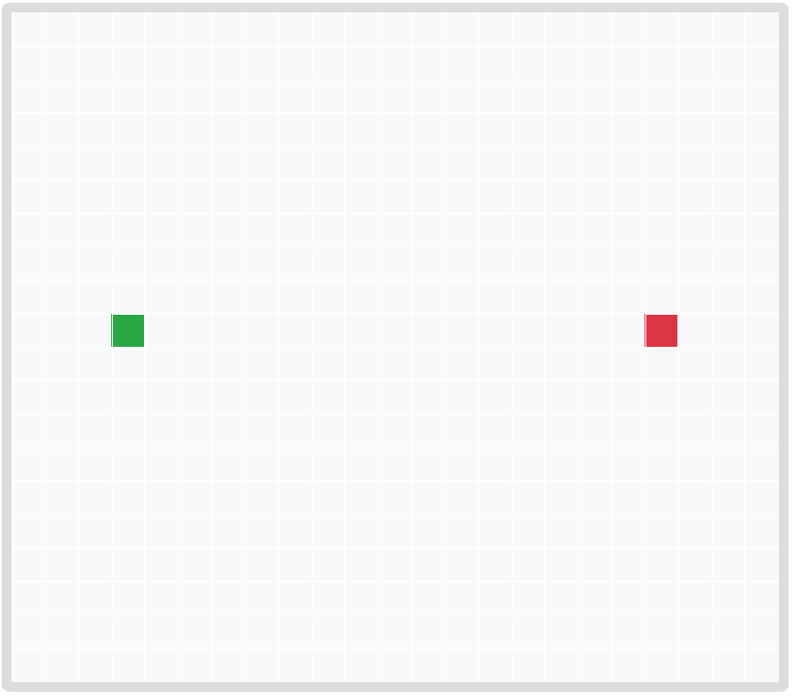
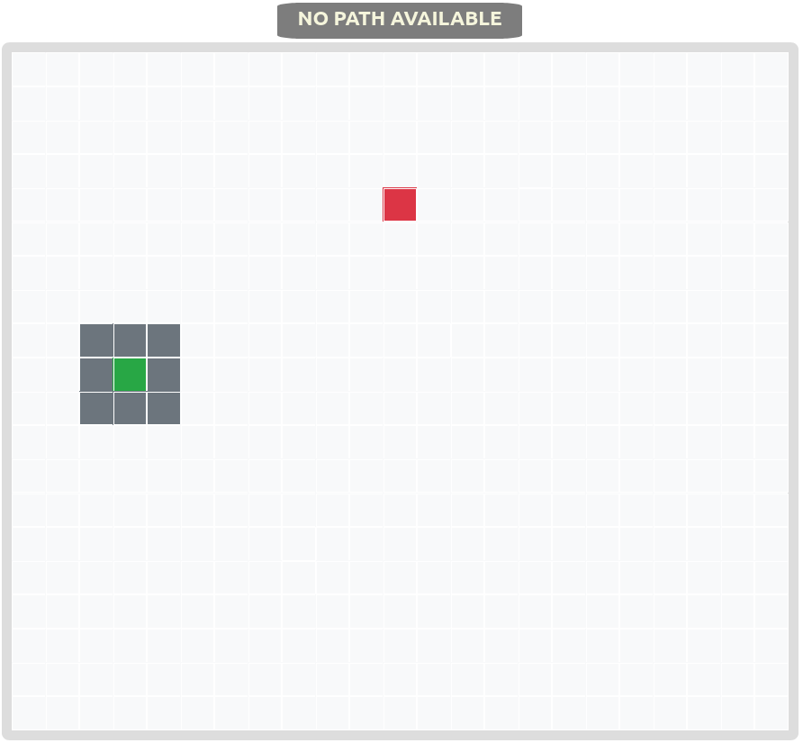
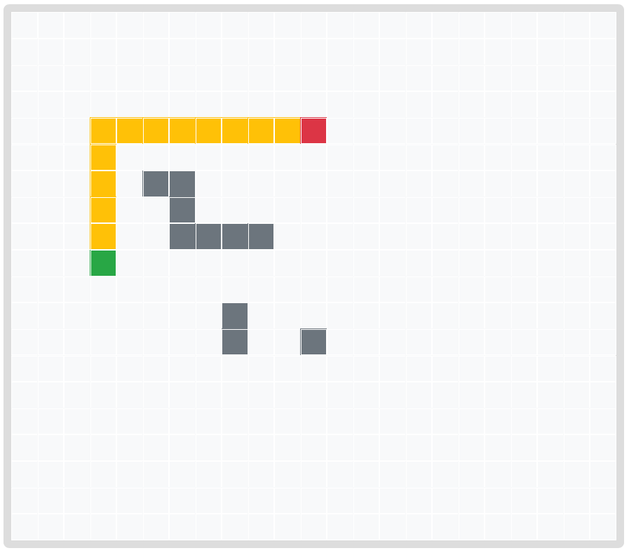

                   

# Navigating the Mars Rover 
## Project submission for the Mars Colonization Program
## Team Red Rovers

**About**

[Red Rovers Application](https://aditi-uma.github.io/Red-Rovers/)

This web app finds the shortest path between two points. It uses Breadth-First Search algorithm to find the path and its length. Diagonal paths can be enabled.

This was bootstrapped using React and Node.js.

We chose to use React because of its relatively gentle learning curve for people new to front-end web development. Our learning process was to learn the basics of HTML, CSS and JavaScript and then watch the video React Tutorial for Beginners [React js], uploaded by Programming with Mosh.

**Usage**

The menu has three options to allow for setting the start, end and obstacles on the board.

On loading, the start and end are set at default squares on the grid and can be changed by choosing the appropriate option on the menu, and choosing the new square.

Clear Obstacles removes all the set obstacles while preserving start and end positions. You can also click on the obstacles themselves to remove them. Reset Board will set the entire board to the default value.

Start Search will generate the shortest path on the board.

If there is none, a message is displayed at the top.

Path Length shows the length of the path.

The checkbox Allow Diagonal Paths can be checked if you wish diagonally adjacent squares to be present in the path. This is a path with this option enabled.

This is a path with Allow Diagonal Paths disabled.

**This project was developed by -**
- **Vyshnavi Badrinarayanan**
- **Aditi Umashankar**
- **From BITS Pilani, Goa Campus**

